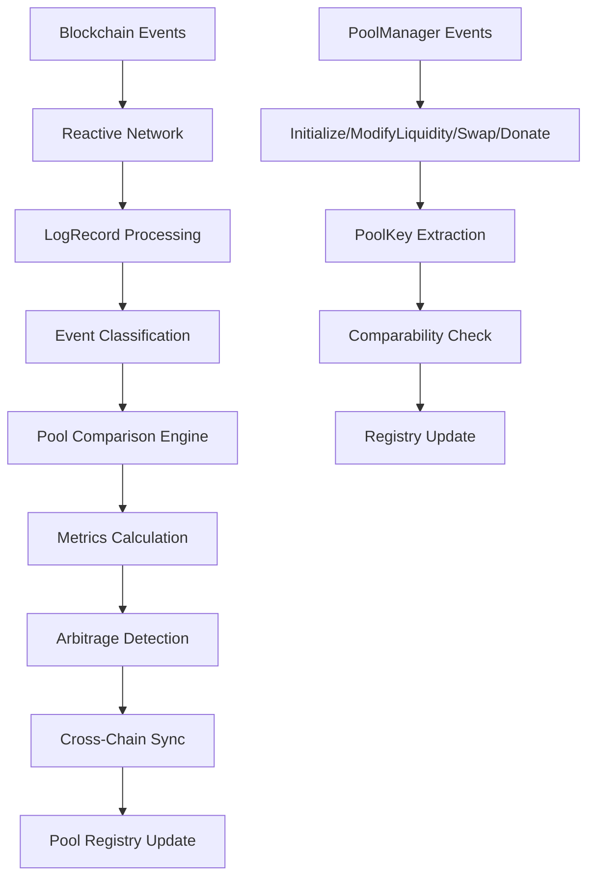

# Reactive Hook Plugins

## Project Overview

The Reactive Hook Plugins project is building an on-chain system for cross-chain pool comparison and metrics creation using Uniswap v4 hooks and the reactive network. The system enables:

- Cross-chain pool comparison and tracking
- Reactive event-driven metrics calculation
- Pool compatibility analysis across different chains


## Architecture

### Overview

The Reactive Hook Plugins system implements a sophisticated cross-chain pool comparison and metrics platform built on Uniswap v4 hooks and the Reactive Network. The architecture follows a reactive, event-driven pattern that enables real-time pool monitoring, comparison, and arbitrage detection across multiple blockchain networks.

### System Components

#### 1. **Reactive Network Layer**
- **AbstractReactive Contracts**: Base reactive contracts that implement the `IReactive` interface
- **Event Subscription System**: Manages event subscriptions across multiple chains
- **Callback Processing**: Handles reactive callbacks triggered by blockchain events
- **LogRecord Processing**: Processes and decodes blockchain log records from various chains

#### 2. **Uniswap v4 Integration Layer**
- **PoolManager Integration**: Interfaces with Uniswap v4 PoolManager contracts
- **Hook System**: Implements custom hooks for pool lifecycle management
- **PoolKey Management**: Handles pool identification and comparison logic
- **Event Monitoring**: Tracks Initialize, ModifyLiquidity, Swap, and Donate events

#### 3. **Cross-Chain Registry System**
- **PoolManagerKey Registry**: Maps chainId + PoolManager address to pool collections
- **Pool Comparison Engine**: Implements pool comparability logic based on currencies and tickSpacing
- **Cross-Chain Synchronization**: Maintains consistent state across multiple chains
- **Chain-Specific Adapters**: Handles different Uniswap v4 implementations per chain

#### 4. **Metrics & Analytics Engine**
- **Pool Comparison Library**: Core algorithms for determining pool comparability
- **Arbitrage Detection**: Real-time identification of arbitrage opportunities
- **Price Analysis**: Cross-chain price comparison and analysis
- **Liquidity Metrics**: Pool health and liquidity analysis

#### 5. **Event Processing System**
- **LogRecordLibrary**: Utilities for processing blockchain log records
- **PoolManagerEventsUtils**: Specialized utilities for Uniswap v4 events
- **Event Registry**: Centralized event management and classification
- **Reactive Callback System**: Event-driven response mechanisms

### Technology Stack

#### **Core Technologies**
- **Solidity**: ^0.8.26 with Cancun EVM support
- **Foundry**: Primary development framework with forge testing
- **Reactive Network**: Event-driven smart contract execution
- **Uniswap v4**: Core AMM protocol integration

#### **Development Tools**
- **Foundry**: Compilation, testing, and deployment
- **Hardhat**: Additional development tooling
- **Forge Std**: Testing utilities and cheatcodes
- **OpenZeppelin**: Security and upgrade patterns

#### **External Dependencies**
- **v4-core**: Uniswap v4 core contracts
- **v4-periphery**: Uniswap v4 peripheral contracts
- **1inch Limit Order Protocol**: Advanced order management
- **Reactive Smart Contract Demos**: Reactive network examples

### Data Flow



### Reactive Network Architecture

#### **Event Subscription Pattern**
```solidity
interface IReactive {
    struct LogRecord {
        uint256 chain_id;
        address _contract;
        uint256 topic_0;
        uint256 topic_1;
        uint256 topic_2;
        uint256 topic_3;
        bytes data;
        uint256 block_number;
        uint256 op_code;
        uint256 block_hash;
        uint256 tx_hash;
        uint256 log_index;
    }
    
    function react(LogRecord calldata log) external;
}
```

#### **Pool Comparison Logic**
- **Comparability Criteria**: Same currencies (currency0, currency1) and tickSpacing
- **PoolKey Structure**: `{currency0, currency1, fee, tickSpacing, hooks}`
- **Cross-Chain Identification**: PoolManagerKey = `{chainId, poolManagerAddress}`

### Foundry Configuration

#### **Compilation Settings**
```toml
[profile.default]
src = "src"
out = "foundry-out"
libs = ["node_modules","lib"]
ffi = true
solc_version = "0.8.26"
evm_version = "cancun"
```

#### **Remappings**
- `@uniswap/v4-core/=lib/v4-periphery/lib/v4-core`
- `@uniswap/v4-periphery/=lib/v4-periphery/`
- `@reactive-network/=lib/reactive-smart-contract-demos/lib/reactive-lib/src/`

#### **RPC Endpoints**
- **Sepolia**: Ethereum testnet for testing
- **Reactive Testnet**: Reactive network for reactive contract deployment

### Security Architecture

#### **Access Control**
- **Reactive Network Only**: `rnOnly()` modifier for reactive network execution
- **VM Only**: `vmOnly()` modifier for virtual machine execution
- **Authorized Senders**: Restricted callback execution

#### **Event Validation**
- **LogRecord Validation**: Comprehensive validation of blockchain events
- **Topic Verification**: Event signature verification through topic0
- **Data Integrity**: ABI decoding and data validation

### Deployment Strategy

#### **Multi-Chain Deployment**
1. **Reactive Network**: Deploy reactive contracts for event processing
2. **Target Chains**: Deploy registry and comparison contracts on supported chains
3. **Cross-Chain Setup**: Configure event subscriptions and callbacks

#### **Environment Configuration**
- **Development**: Local foundry testing with mock contracts
- **Testing**: Sepolia testnet with reactive testnet integration
- **Production**: Multi-chain deployment with full reactive network integration

### Performance Considerations

#### **Gas Optimization**
- **Pure Functions**: Pool comparison logic uses pure functions for gas efficiency
- **Library Usage**: Extensive use of libraries to reduce contract size
- **Event Processing**: Optimized log record processing for minimal gas usage

#### **Scalability**
- **Batch Processing**: Support for batch pool comparisons
- **Event Filtering**: Efficient event filtering and routing
- **Cross-Chain Efficiency**: Optimized cross-chain data synchronization

### Future Enhancements

#### **Planned Features**
- **Dynamic Fee Comparison**: Advanced fee structure analysis
- **Hook Compatibility**: Comprehensive hook compatibility checking
- **Automated Arbitrage**: Automated arbitrage execution
- **Advanced Analytics**: Machine learning-based pool analysis

#### **Integration Opportunities**
- **MEV Protection**: Integration with MEV protection mechanisms
- **Cross-Chain Bridges**: Enhanced cross-chain asset transfers
- **Liquidity Aggregation**: Multi-protocol liquidity aggregation


